# Kubernetes Leader Election Approaches: Visual Reference

This page contains all Mermaid diagrams for Kubernetes leader election in production.

## 1️⃣ Kubernetes Native Lease API

Best for: Cloud-native teams, K8s-only infrastructure

```mermaid
graph TD
    A["K8s Cluster"] --> B["Pod 1<br/>Watch Lease"]
    A --> C["Pod 2<br/>Watch Lease"]
    A --> D["Pod 3<br/>Watch Lease"]
    
    B --> E["Kubernetes Lease API<br/>etcd Backed"]
    C --> E
    D --> E
    
    E --> F["Lease State<br/>holder: Pod 1<br/>ttl: 15s<br/>version: 42"]
    
    F --> G["Pod 1 Renews<br/>Every 5s"]
    
    G --> H["✅ Pod 1 Holds<br/>Leadership"]
    H --> I["Executes<br/>Scheduled Job"]
    
    style A fill:#e1f5ff
    style H fill:#c8e6c9
    style I fill:#fff9c4
    style E fill:#ffccbc
```

**Key Points:**
- Uses etcd (built-in with K8s)
- Lease renewal = automatic re-election trigger
- 15-30s failover time
- Only 1 pod can hold lease (atomic CAS)

---

## 2️⃣ Consul/etcd (External Coordination)

Best for: Multi-cluster deployments, cross-datacenter failover

**Key Points:**
- External single source of truth
- Survives Kubernetes cluster failure
- Subject leader across multiple clusters
- 5-15s failover (faster than K8s)

---

## 3️⃣ Database-Backed Leader Lock

Best for: Teams with strong DB infrastructure (PostgreSQL, MySQL)

**Key Points:**
- Uses ACID guarantees of your DB
- Pessimistic locking (blocks others)
- 10-30s failover via TTL polling
- Simplest to debug (query the lock table)

---

## 4️⃣ Redis Pub/Sub with Lease

Best for: High-speed coordination, existing Redis infrastructure

```mermaid
graph TD
    A["Pod 1"] --> B["SETNX Lock<br/>EX 30s"]
    C["Pod 2"] --> B
    D["Pod 3"] --> B
    
    B --> E["Redis Instance"]
    C --> F["SUB election<br/>Channel"]
    D --> F
    
    E --> G["Key: job:lock<br/>Value: pod-1<br/>TTL: 30s"]
    F --> H["Watch for<br/>Election Events"]
    
    B -.->|✅ SUCCESS| I["Pod 1: Leader"]
    C -.->|❌ FAIL| J["Pod 2: Standby"]
    D -.->|❌ FAIL| K["Pod 3: Standby"]
    
    I --> L["Executes Job"]
    I --> M["PUBLISH<br/>election event<br/>leader=pod-1"]
    
    M --> H
    H --> N["Pods 2,3: Notified<br/>Know Pod 1 is leading"]
    
    style E fill:#ffccbc
    style I fill:#c8e6c9
    style L fill:#fff9c4
    style M fill:#fff9c4
```

**Key Points:**
- Fast (in-memory operations)
- Pub/Sub = instant notifications
- 10-30s failover via TTL
- Observable via event stream

---

## 5️⃣ Message Queue (Kafka) Pattern

Best for: Event-driven architectures, decoupled systems

**Key Points:**
- Decoupled producer/consumer
- Single partition enforces ordering
- Only 1 consumer reads per partition
- Offset tracking enables recovery

---

## 🎯 Decision Tree: Choose Your Approach

```mermaid
graph TD
    A["5 Production Approaches<br/>for K8s Leader Election"] 
    
    A --> B["K8s Native<br/>Lease API"]
    A --> C["External<br/>Consul/etcd"]
    A --> D["Database<br/>Pessimistic Lock"]
    A --> E["Redis<br/>Pub/Sub"]
    A --> F["Message Queue<br/>Kafka/SQS"]
    
    B --> B1["✅ Native Integration<br/>✅ No New Services<br/>❌ 15-30s Failover"]
    
    C --> C1["✅ Multi-Cluster<br/>✅ Strong Consistency<br/>❌ Extra Service"]
    
    D --> D1["✅ Simplest<br/>✅ Existing DB<br/>❌ Bottleneck at Scale"]
    
    E --> E1["✅ Fast - In Memory<br/>✅ Observable Events<br/>❌ Another Dependency"]
    
    F --> F1["✅ Decoupled<br/>✅ Scalable<br/>❌ Complex Setup"]
    
    B1 --> G["Choose Based On:<br/>• Cluster Topology<br/>• Scale Requirements<br/>• Existing Infra<br/>• Failure Recovery Time"]
    C1 --> G
    D1 --> G
    E1 --> G
    F1 --> G
    
    style A fill:#e1f5ff
    style B fill:#c8e6c9
    style C fill:#c8e6c9
    style D fill:#c8e6c9
    style E fill:#c8e6c9
    style F fill:#c8e6c9
```

---

## ⚠️ Critical Failure Scenario: Leader Crash

```mermaid
sequenceDiagram
    participant Pod1
    participant K8s as Kubernetes etcd
    participant Pod2
    participant Pod3
    
    Note over Pod1,Pod3: Time T=0 (Normal Operation)
    Pod1->>K8s: Renew Lease (Pod1 is leader)
    K8s-->>Pod1: ✅ Success
    
    Pod2->>K8s: Watch Lease (Read-only)
    K8s-->>Pod2: Leader: Pod1
    
    Pod3->>K8s: Watch Lease (Read-only)
    K8s-->>Pod3: Leader: Pod1
    
    Note over Pod1: Pod1 executes scheduled job
    Pod1->>Pod1: Execute Job (00:00 - 00:30)
    
    Note over Pod1,Pod3: Time T=10 (Pod1 Crashes)
    Pod1->>Pod1: ❌ CRASH! Out of Memory
    Pod1--xK8s: (connection lost)
    
    Note over Pod1,Pod3: Time T=15 (Lease Expires)
    K8s->>K8s: Lease TTL = 15s<br/>Lease Expired!
    K8s-->>Pod2: 🔔 Lease Expired!
    K8s-->>Pod3: 🔔 Lease Expired!
    
    Note over Pod1,Pod3: Time T=16 (New Election)
    Pod2->>K8s: Try Acquire Lease
    Pod3->>K8s: Try Acquire Lease
    
    K8s-->>Pod2: ✅ Success! You are leader
    K8s-->>Pod3: ❌ Conflict (already taken)
    
    Note over Pod2: Pod2 is now leader
    Pod2->>Pod2: Execute Job (00:30 - 01:00)
    
    Note over Pod2: Key: Pod2 checks idempotency<br/>Finds previous execution (by Pod1)<br/>Does NOT re-execute
```

**Critical Insight:**
- Lease expires, NOT immediately
- Requires TTL enforcement
- New pod checks for duplicate execution via idempotency key
- Database prevents actual duplicate processing

---

## 📊 Quick Comparison

| Approach | Setup | Latency | Failover | Scale | Complexity |
|----------|-------|---------|----------|-------|------------|
| K8s Lease | 🟢 30m | 🟠 100-500ms | 15-30s | ⭐⭐⭐⭐⭐ | 🟡 Medium |
| Consul | 🟠 2h | 🟢 50-200ms | 5-15s | ⭐⭐⭐⭐⭐ | 🔴 Hard |
| Database | 🟢 10m | 🟠 50-300ms | 10-30s | ⭐⭐ | 🟢 Easy |
| Redis | 🟢 15m | 🟢 <10ms | 10-30s | ⭐⭐⭐⭐ | 🟡 Medium |
| Kafka | 🟠 1h | 🟡 1-100ms | Offset-based | ⭐⭐⭐⭐⭐ | 🔴 Hard |

---

## 🎓 Interview Tips

> **Pro Tip**: Draw these diagrams from memory during your interview. It shows you understand the underlying patterns, not just the code.

1. **Start simple**: K8s Lease API (most common)
2. **Show tradeoffs**: Why Consul is different
3. **Explain failure**: What happens when leader crashes
4. **Mention idempotency**: CRITICAL for senior level
5. **Reference production**: "We monitor election frequency..."

---

## 📖 Full Documentation

See parent directory for complete guides:
- [06-Kubernetes-Leader-Election-Production.md](06-Kubernetes-Leader-Election-Production.md) - Full deep-dive
- [07-Leader-Election-Interview-Cheat-Sheet.md](07-Leader-Election-Interview-Cheat-Sheet.md) - 2-minute answer

