# Mermaid Diagrams for Distributed Job Scheduling

This directory contains visual diagrams to support the distributed job scheduling guide. All diagrams include technology stack logos and component labels for easy understanding.

## 🏗️ Architecture Diagrams (With Component Logos)

### A1. [architecture-redis-lock.mmd](architecture-redis-lock.mmd) | [📸 PNG](architecture-redis-lock.png)
**Redis Distributed Lock Architecture - Complete Stack**

Shows:
- ⚙️ Multiple Spring Boot instances competing
- 🗄️ Redis with SETNX + TTL mechanism
- 📋 Job execution flow
- 📊 Prometheus + Grafana monitoring
- Color-coded winner vs waiting instances

**Perfect for interviews**: Draw this to show simple yet production-ready approach

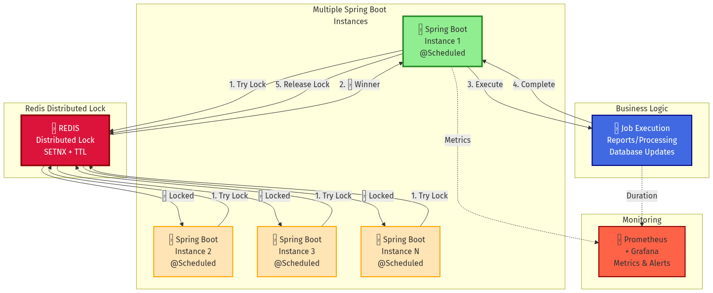

---

### A2. [architecture-kubernetes-leader.mmd](architecture-kubernetes-leader.mmd) | [📸 PNG](architecture-kubernetes-leader.png)
**Kubernetes Leader Election - Cloud Native**

Shows:
- ☸️ Kubernetes pods with leader/follower roles
- 🔐 Lease API for leader election
- 👑 Only leader executes jobs
- ⏱️ Heartbeat and failover mechanism
- ☸️ K8s Dashboard + Prometheus monitoring

**Perfect for interviews**: Demonstrate modern cloud-native approach

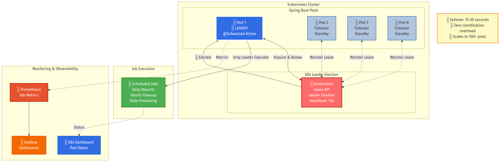

---

### A3. [architecture-queue-based.mmd](architecture-queue-based.mmd) | [📸 PNG](architecture-queue-based.png)
**Queue-Based Architecture - High Scale**

Shows:
- ⚙️ Lightweight Spring Boot schedulers
- 📨 Kafka / 📬 SQS / 🐰 RabbitMQ options
- 👷 Auto-scaling worker pool
- 🗄️ PostgreSQL + Redis for state
- ☁️ CloudWatch + Prometheus monitoring
- Benefits: Horizontal scaling, spike protection

**Perfect for interviews**: Show how to handle 10M+ jobs/day

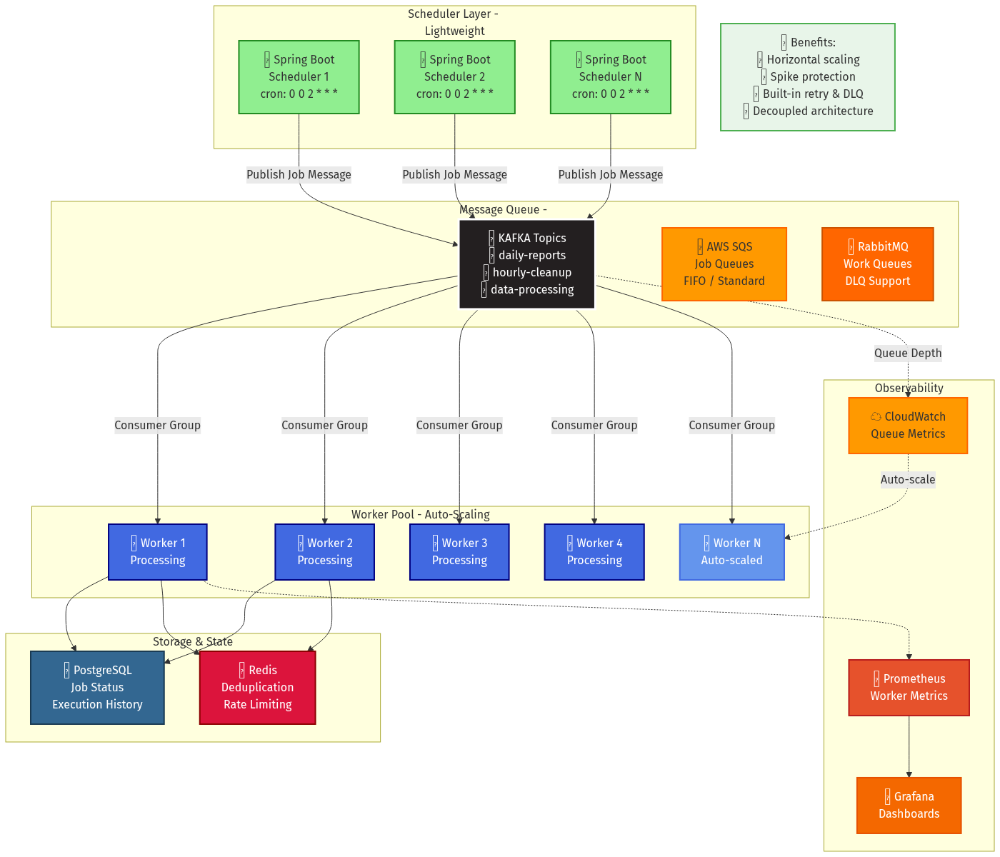

---

### A4. [architecture-all-approaches.mmd](architecture-all-approaches.mmd) | [📸 PNG](architecture-all-approaches.png)
**All 5 Approaches Comparison**

Shows side-by-side:
1. 🗄️ Redis Lock (5-20 instances)
2. ☸️ Leader Election (50+ instances)
3. 🕐 Quartz Clustered (10-100 instances)
4. 📨 Queue-Based (10M+ jobs/day)
5. ☸️ K8s CronJob (GPU/isolated jobs)

With selection criteria and decision flows

**Perfect for interviews**: Show systematic decision-making

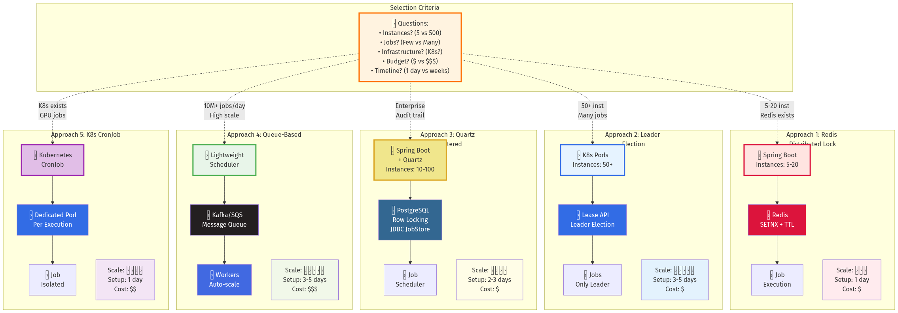

---

### A5. [architecture-full-stack.mmd](architecture-full-stack.mmd) | [📸 PNG](architecture-full-stack.png)
**Complete Production Technology Stack**

Shows entire ecosystem:
- ⚙️ Spring Boot 3.2 + Java 17
- 🗄️ Redis, ☸️ Kubernetes, 🔷 ZooKeeper
- 📨 Kafka, 📬 SQS, 🐰 RabbitMQ
- 🕐 Quartz, ☸️ K8s CronJob
- 🗄️ PostgreSQL, 🗄️ Redis Cache, ☁️ S3
- 📊 Prometheus, 📈 Grafana, 📝 ELK
- 🔐 AWS Cognito, 🔑 IAM

**Perfect for interviews**: Show comprehensive understanding of production stack

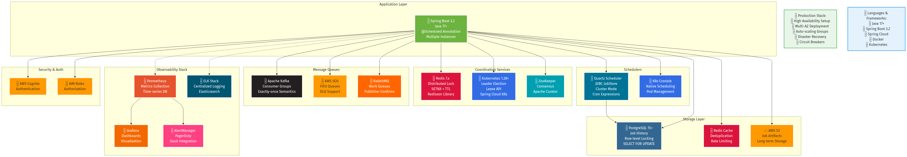

---

## 📊 Flow & Sequence Diagrams

### 1. [redis-lock-sequence.mmd](redis-lock-sequence.mmd) | [📸 PNG](redis-lock-sequence.png)
**Sequence diagram showing Redis distributed lock pattern**

Visualizes:
- Multiple instances competing for lock
- Atomic SETNX operation
- Only one instance proceeds
- Lock release after completion

**Use in interview**: Draw this to explain how distributed lock prevents duplicate execution

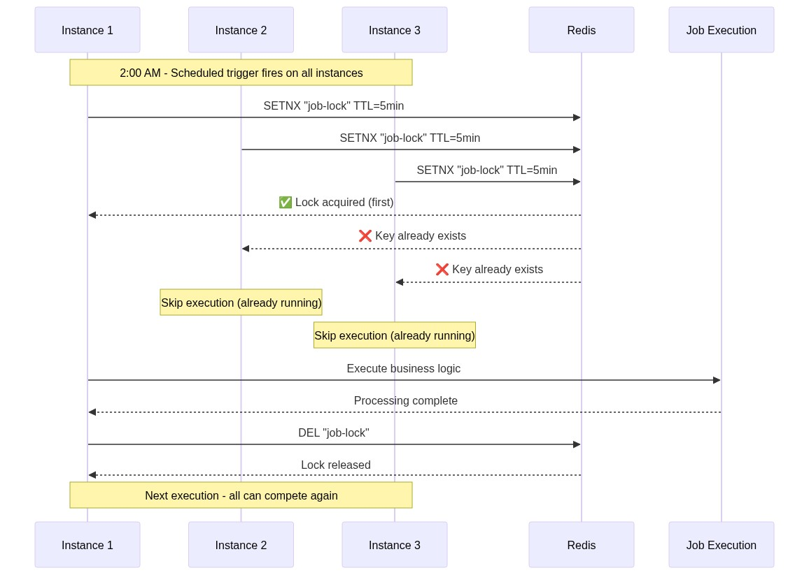

---

### 2. [leader-election-sequence.mmd](leader-election-sequence.mmd) | [📸 PNG](leader-election-sequence.png)
**Sequence diagram showing leader election with failover**

Visualizes:
- Leader election on startup
- Only leader runs scheduled jobs
- Heartbeat/lease renewal
- Automatic failover when leader crashes

**Use in interview**: Show this when explaining leader election approach and fault tolerance

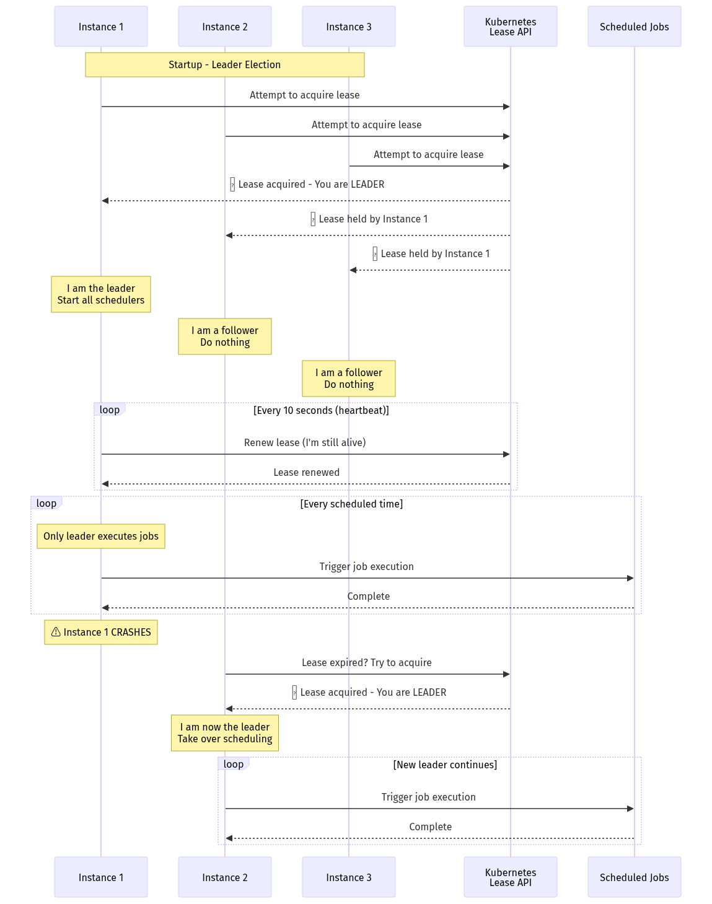

---

### 3. [queue-based-architecture.mmd](queue-based-architecture.mmd) | [📸 PNG](queue-based-architecture.png)
**Architecture diagram of queue-based scheduling pattern**

Visualizes:
- Lightweight schedulers publishing to queue
- Message queue (Kafka/SQS) in the middle
- Auto-scaling worker pool consuming messages
- Queue depth monitoring

**Use in interview**: Demonstrate decoupled architecture and horizontal scalability

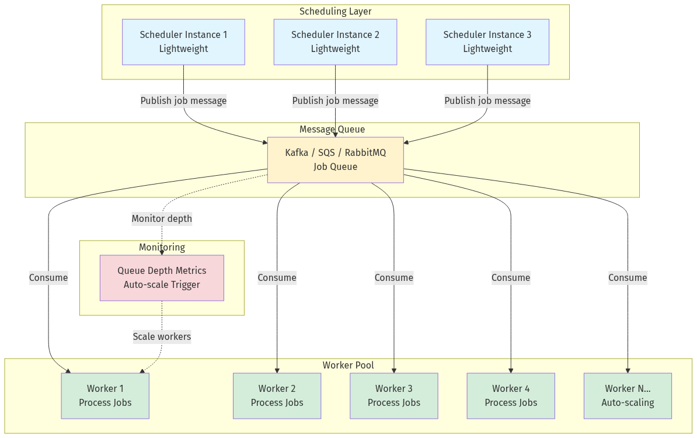

---

### 4. [decision-tree.mmd](decision-tree.mmd) | [📸 PNG](decision-tree.png)
**Decision tree for choosing the right approach**

Visualizes:
- Questions to ask (scale, infrastructure, requirements)
- Decision points
- Recommended approach for each scenario

**Use in interview**: Show systematic decision-making process

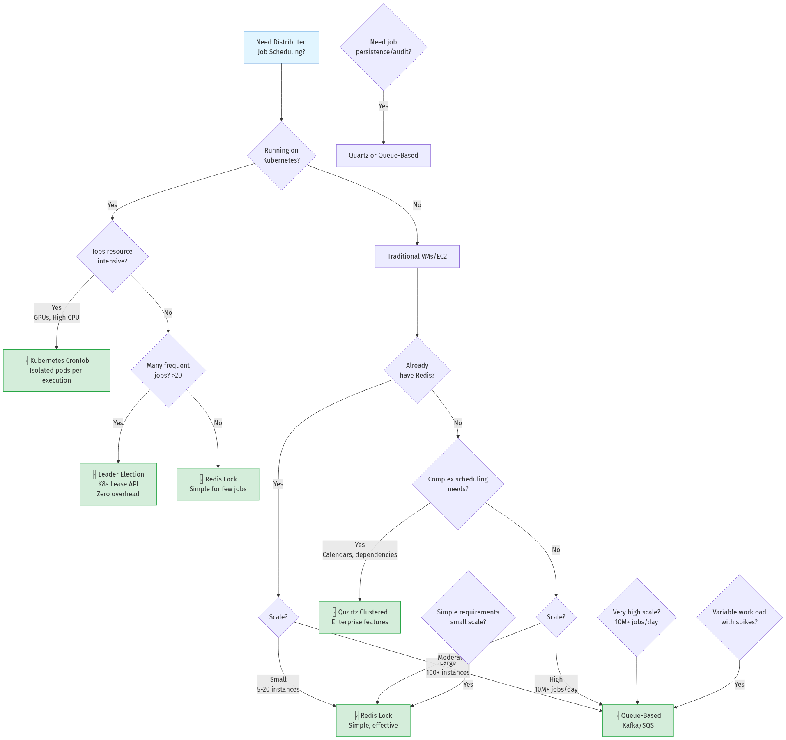

---

### 5. [failure-recovery.mmd](failure-recovery.mmd) | [📸 PNG](failure-recovery.png)
**Sequence diagram showing crash recovery with TTL**

Visualizes:
- Normal job execution
- Instance crash mid-execution
- TTL-based automatic lock release
- Another instance taking over
- Recovery timeline

**Use in interview**: Explain fault tolerance and TTL importance

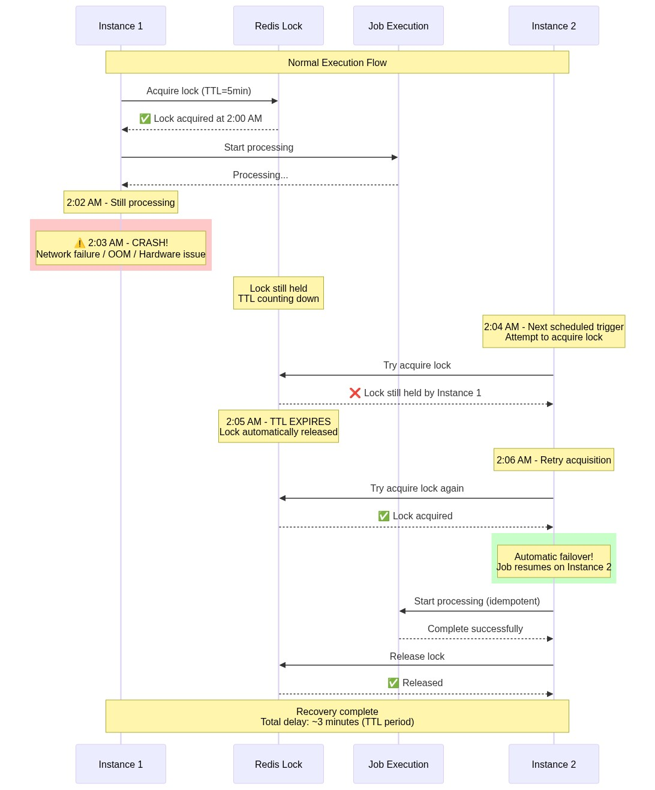

---

### 6. [idempotency-pattern.mmd](idempotency-pattern.mmd) | [📸 PNG](idempotency-pattern.png)
**Sequence diagram demonstrating idempotent execution**

Visualizes:
- First execution inserting unique execution ID
- Payment processing
- Duplicate attempt detecting existing execution
- No double-charging (safe idempotency)

**Use in interview**: Critical for explaining why idempotency matters

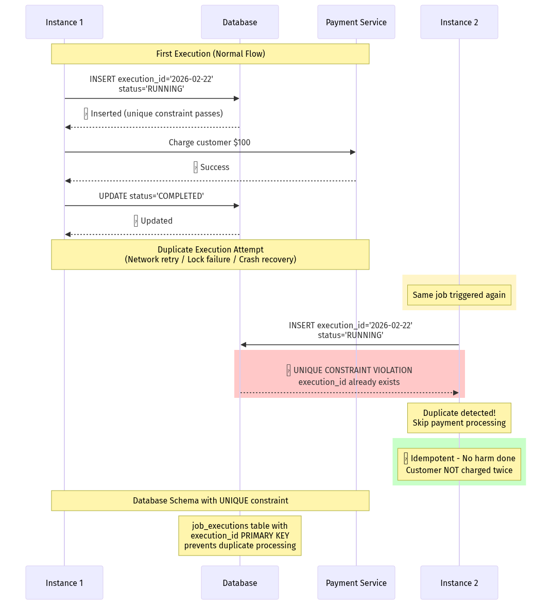

---

## 🎯 How to Use These Diagrams in Interviews

### Quick Reference Guide

**For Basic Understanding (10 min prep)**:
1. [architecture-redis-lock.png](architecture-redis-lock.png) - Simple approach
2. [architecture-kubernetes-leader.png](architecture-kubernetes-leader.png) - Modern approach

**For Comprehensive Answer (30 min prep)**:
3. [architecture-all-approaches.png](architecture-all-approaches.png) - Comparison
4. [decision-tree.png](decision-tree.png) - When to use what
5. [failure-recovery.png](failure-recovery.png) - Fault tolerance

**For Deep Dive (If interviewer probes)**:
6. [architecture-full-stack.png](architecture-full-stack.png) - Production stack
7. [architecture-queue-based.png](architecture-queue-based.png) - High scale
8. [idempotency-pattern.png](idempotency-pattern.png) - Safety guarantees

### Interview Strategy

**1st Minute**: Show [architecture-redis-lock.png](architecture-redis-lock.png)
- "For 5-20 instances, I use Redis distributed lock with..."
- Point to components: Spring Boot → Redis SETNX → Job execution
- Mention: TTL for crash recovery, Prometheus for monitoring

**2nd Minute**: Show [architecture-all-approaches.png](architecture-all-approaches.png)
- "At larger scale, I consider these alternatives..."
- Quickly contrast: Lock vs Leader vs Queue
- State when to use each based on scale

**If Asked About Failures**: Show [failure-recovery.png](failure-recovery.png)
- Walk through crash scenario
- Explain TTL-based recovery
- Mention idempotency

**If Asked About Scale**: Show [architecture-queue-based.png](architecture-queue-based.png)
- "At 10M+ jobs/day, queue-based architecture..."
- Highlight: Decoupling, auto-scaling, spike protection

**If Asked About Technology**: Show [architecture-full-stack.png](architecture-full-stack.png)
- "In production, complete stack includes..."
- Demonstrate breadth: Storage, Queue, Monitoring, Security

### Drawing Tips for Whiteboard

**Simplify to 3 boxes**:
```
[Multiple Instances] → [Coordination] → [Job Execution]
```

**Add logos as labels**:
- Write "Redis 🗄️" not just "Cache"
- Write "Kubernetes ☸️" not just "Container platform"
- Write "Kafka 📨" not just "Message queue"

**Color coding on whiteboard**:
- Winner/Active = Green circle
- Waiting/Standby = Blue circle
- Failed/Blocked = Red X
- Monitoring = Orange dash lines

---

## 📋 Diagram Categories

### Architecture Diagrams (5)
Full system design with all components - **USE THESE IN INTERVIEWS**
- Focus on showing technology logos and stack
- Color-coded for visual clarity
- Production-ready elements included

### Sequence Diagrams (3)
Step-by-step flow over time
- Good for explaining "what happens when..."
- Shows interactions between components

### Decision Diagrams (1)
When to use which approach
- Flowchart for systematic thinking
- Shows decision criteria

### Pattern Diagrams (2)
Specific patterns like idempotency
- Deep dive on critical concepts
- Shows failure handling

---

## 🎨 Visual Elements Guide

### Emoji/Icon Legend
- ⚙️ = Spring Boot / Application
- 🗄️ = Redis / Database
- ☸️ = Kubernetes
- 📨 = Kafka
- 📬 = AWS SQS
- 🐰 = RabbitMQ
- 🕐 = Quartz Scheduler
- 👷 = Worker Processes
- 📊 = Prometheus
- 📈 = Grafana
- 🔐 = Security/Auth
- 💡 = Important Note/Tip
- ✅ = Benefit/Success
- ❌ = Blocked/Failed

### Color Scheme
- **Red** (#DC143C) = Redis
- **Blue** (#326CE5) = Kubernetes
- **Black** (#231F20) = Kafka
- **Orange** (#FF9900) = AWS Services
- **Green** (#4CAF50) = Success/Jobs
- **Purple** (#9C27B0) = Alternative approach

---

## 📦 All Diagrams Summary

| Diagram | Type | Size | Best For |
|---------|------|------|----------|
| architecture-redis-lock | Architecture | 114K | Basic interview answer |
| architecture-kubernetes-leader | Architecture | 117K | Cloud-native approach |
| architecture-queue-based | Architecture | 168K | High-scale scenarios |
| architecture-all-approaches | Comparison | 173K | Decision-making |
| architecture-full-stack | Complete | 268K | Deep technical dive |
| redis-lock-sequence | Sequence | 94K | Flow explanation |
| leader-election-sequence | Sequence | 110K | Failover mechanism |
| queue-based-architecture | Architecture | 90K | Decoupled design |
| decision-tree | Flowchart | 196K | Systematic choice |
| failure-recovery | Sequence | 122K | Crash recovery |
| idempotency-pattern | Pattern | 102K | Safety guarantee |

**Total: 11 diagrams covering all aspects of distributed job scheduling**

---

## 🎨 How to Use These Diagrams

### In Interviews
1. **Ask for whiteboard**: "Can I draw this to explain?"
2. **Draw simplified version**: Don't copy exactly, show understanding
3. **Narrate while drawing**: Explain each component
4. **Use to answer follow-ups**: "Let me show what happens when this fails..."

### For Study
1. View rendered diagrams in VS Code (Mermaid preview extension)
2. Practice drawing simplified versions on paper
3. Time yourself - can you draw in 2 minutes?
4. Explain out loud while drawing for practice

### To Generate PNG/SVG

**✓ PNG files are already included in this directory!**

If you need to regenerate them or create new formats:

**Using Kroki.io API** (recommended):
```bash
# Generate PNG for a specific diagram
cat diagram-name.mmd | python3 -c "
import sys, zlib, base64
content = sys.stdin.read()
compressed = zlib.compress(content.encode('utf-8'))
encoded = base64.urlsafe_b64encode(compressed).decode('ascii')
print('https://kroki.io/mermaid/png/' + encoded)
" | xargs curl -s -o diagram-name.png
```

**Using Mermaid CLI** (requires installation):
```bash
# Install mermaid-cli
npm install -g @mermaid-js/mermaid-cli

# Generate PNG
mmdc -i redis-lock-sequence.mmd -o redis-lock-sequence.png

# Generate SVG
mmdc -i leader-election-sequence.mmd -o leader-election-sequence.svg -b transparent
```

Or use online tools:
- https://kroki.io (supports API)
- https://mermaid.live (interactive editor)

---

## 💡 Diagram Drawing Tips for Interviews

### What to Draw
- **Boxes**: Components (instances, services, databases)
- **Arrows**: Data flow, requests
- **Dotted lines**: Async operations, optional flows
- **Color coding**: Success (green), failure (red), normal (blue)
- **Annotations**: Add small notes explaining key points

### What NOT to Do
- Don't draw perfectly - rough is fine
- Don't spend >3 minutes drawing
- Don't clutter with too many details
- Don't draw without explaining

### Example: Simplified Redis Lock (1 minute)

```
[Inst 1]  [Inst 2]  [Inst 3]
   |          |         |
   └──────────┼─────────┘
              ↓
         [Redis Lock]
              ↓
          (TTL=5min)
              ↓
         Only one runs
              ↓
         [Job Execution]
```

**While drawing, say**:
> "All instances attempt to acquire Redis lock atomically. Only one succeeds. TTL ensures crash recovery. The winner executes the job which is designed to be idempotent."

---

## 📚 Related Chapter References

- [01-Core-Problem-and-Architecture.md](../01-Core-Problem-and-Architecture.md) - Background on why we need this
- [02-Implementation-Approaches.md](../02-Implementation-Approaches.md) - Code for each approach
- [03-Failure-Handling-and-Idempotency.md](../03-Failure-Handling-and-Idempotency.md) - Failure scenarios and idempotency
- [05-Interview-Cheat-Sheet.md](../05-Interview-Cheat-Sheet.md) - Quick reference for interviews

---

## 🔧 Mermaid Syntax Quick Reference

### Sequence Diagram
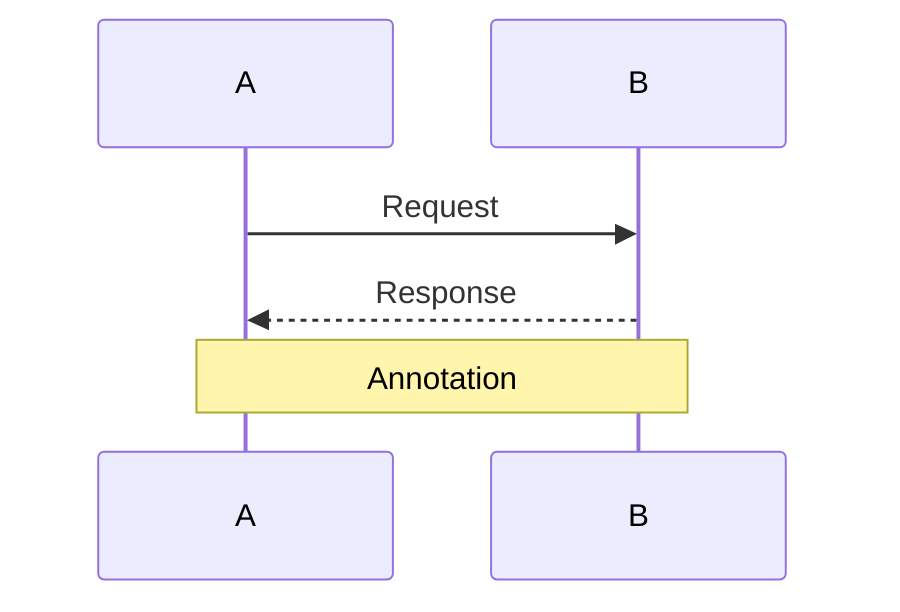

### Flowchart
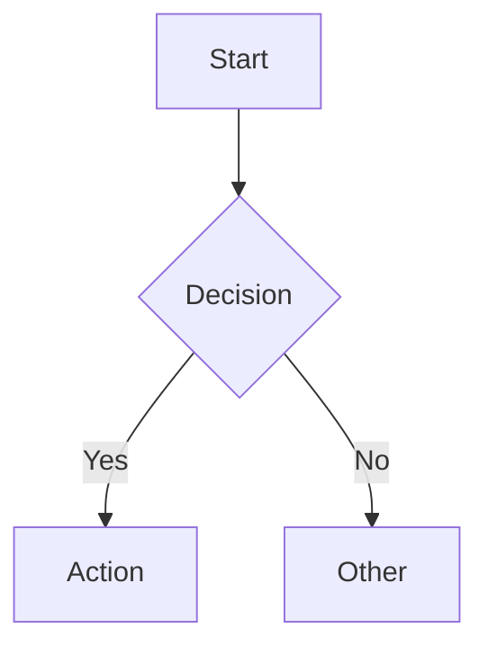

### Architecture Diagram
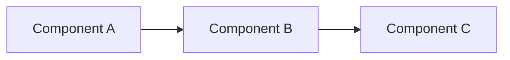

Learn more: https://mermaid.js.org/
