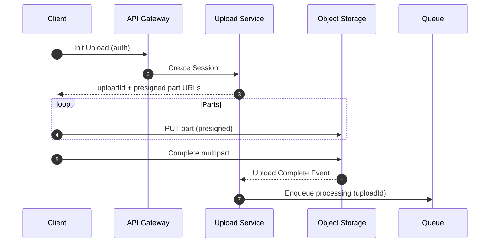
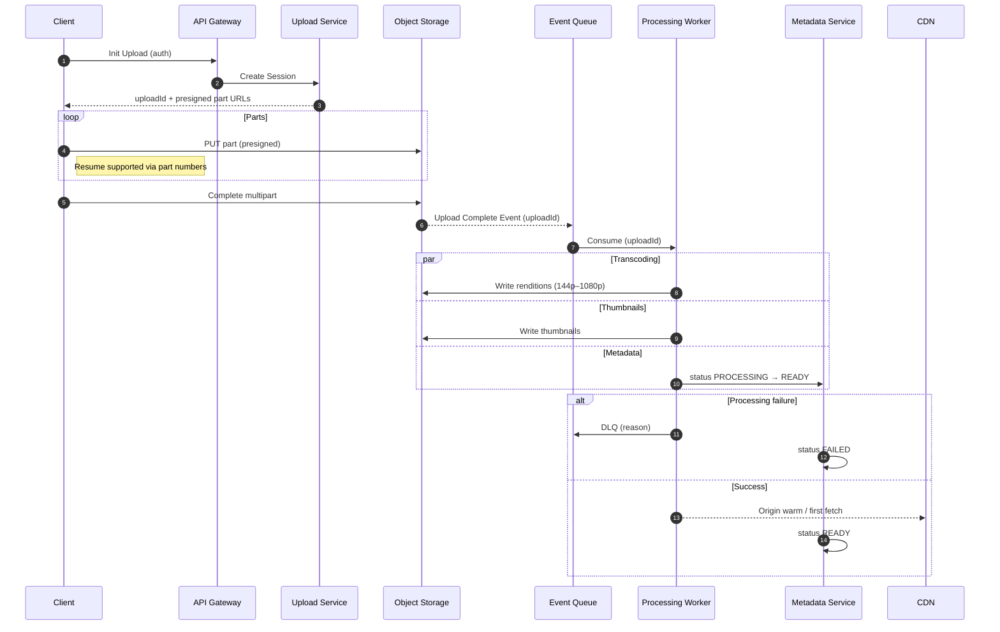

## Interview-Ready Diagram (Mermaid)

Paste this into Mermaid Live Editor (https://mermaid.live) or any Markdown viewer that supports Mermaid to render a clean diagram.

```mermaid
flowchart TB
        %% Nodes
        A[Web / App]
        B[API Gateway\nAuth + Rate Limit]
        C[Upload Service\nStateless\nReturns: uploadId, presigned URLs, multipart info]
        D[(Object Storage)\nRaw Videos]
        E[Event Queue\nKafka / SQS]
        F[Video Processing Pipeline\nTranscode 144p–1080p\nThumbnails\nCodec check\nMalware scan\nContent ID]
        G[(Object Storage)\nProcessed Videos]
        H[CDN]
        M[Metadata Service]
        N[(Metadata DB)\nSQL]
        X[Dead Letter Queue]
        Y[Alerts + Manual Ops]

        %% Control Plane (Low QPS, metadata only)
        subgraph CP[CONTROL PLANE]
                A -- |1) Upload Init| --> B
                B --> C
                C -- |2) Session Response| --> A
        end

        %% Data Plane (High throughput bytes)
        subgraph DP[DATA PLANE]
                A -- |3) Multipart Upload + Resume| --> D
                D -- |4) Upload Complete Event| --> E
                E -- |5) Async Processing| --> F
                F -- |6) Renditions + Thumbnails| --> G
                G -- |7) Origin Fetch| --> H
        end

        %% Metadata & State
        E --> M
        M --> N

        %% Failure Handling
        E -. retries .-> E
        E -. DLQ .-> X
        X --> Y

        %% Styles (optional)
        classDef plane fill:#eef,stroke:#88a,stroke-width:1px;
        classDef storage fill:#efe,stroke:#8a8,stroke-width:1px;
        classDef process fill:#fee,stroke:#a88,stroke-width:1px;
        class A,B,C,CP plane;
        class D,G storage;
        class F process;
```

### Optional: Multipart Upload Sequence
Paste into Mermaid Live Editor as a second diagram.



### Talking Points (use with the diagram)
- Control vs Data Plane separation: metadata low-QPS; bytes direct to storage via presigned URLs.
- Idempotency via `uploadId` and deterministic object keys; safe retries.
- Eventual consistency: reconcile via processing events + status updates in SQL.
- Backpressure: autoscale consumers on queue lag; API rate limits protect control plane.
- Failure handling: bounded retries → DLQ → alerts and manual ops.
- Observability: track `uploadId` across logs/metrics/traces; SLIs include time-to-ready and CDN hit ratio.

### Alternative Online Tools
- diagrams.net (draw.io): manual diagramming with layers, export PNG/SVG.
- Excalidraw: hand-drawn style; great for whiteboard interviews.
- PlantUML Editor: code-first diagrams; good for sequence/state diagrams.
- Miro or Figma: collaborative boards; polished visual styling.

## Demo Architecture Diagram (Mermaid)
Use for live demos; horizontally grouped lanes with minimal text.

```mermaid
flowchart LR
        %% Lanes
        subgraph Client[Client]
                A[Web/App]
        end
        subgraph Control[Control Plane\n(low QPS)]
                B[API Gateway\nAuth + Rate Limit]
                C[Upload Service\nStateless]
                M[Metadata Service]
                N[(Metadata DB)\nSQL]
        end
        subgraph Data[Data Plane\n(high throughput)]
                D[(Object Storage)\nRaw]
                G[(Object Storage)\nProcessed]
                H[CDN]
        end
        subgraph Async[Async Pipeline]
                E[Event Queue\nKafka/SQS]
                F[Workers\nTranscode, Scan, Content ID]
                X[Dead Letter Queue]
                Y[Alerts + Manual Ops]
        end

        %% Flow
        A -- Init --> B
        B --> C
        C -- Session (uploadId + URLs) --> A
        A -- Multipart PUT --> D
        D -- Complete Event --> E
        E --> F
        F -- Renditions/Thumbs --> G
        G -- Origin Fetch --> H

        %% Metadata & Failure
        F --> M
        M --> N
        F -. failure .-> X
        X --> Y

        %% Styles
        classDef lane fill:#f8f8ff,stroke:#9aa,stroke-width:1px;
        classDef store fill:#eefcef,stroke:#8a8,stroke-width:1px;
        classDef work fill:#fff0f0,stroke:#a88,stroke-width:1px;
        class Client,Control,Data,Async lane;
        class D,G store;
        class F work;
```

## Demo Sequence Diagram (Mermaid)
Includes retries, resume, and success/failure branches.



### Demo Tips
- Keep text minimal; narrate steps verbally using the numbering.
- Use `uploadId` as the thread of traceability across both diagrams.
- Highlight Control vs Data Plane first, then zoom into the sequence.
